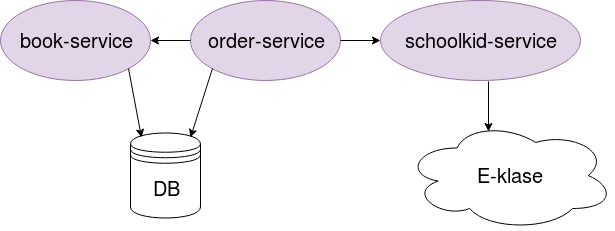

# REST API acceptance test framework: Sample app

 

This is a sample app - School library app - used to play with REST API acceptance test framework. The intention of the  
app is to allow schoolkids to order the books.   

School library app consists of 3 microservices, implemented as Gradle modules:

* **book-service** - a CRUD service for library books
* **schoolkid-service** - provides information about schoolkids. Supposed to integrate with E-klase (Latvian online secondary education portal)
* **order-service** - manages book orders 

## Build

To build the app you need to run `./gradlew clean build`.

To create Docker images (which you'll need for REST acceptance tests) run `./gradlew clean buildImages`